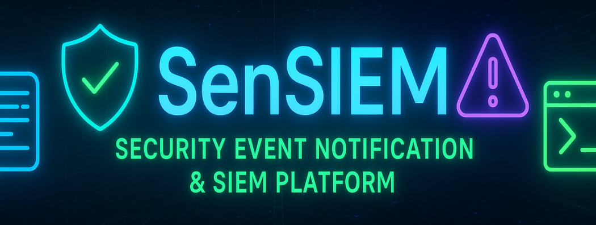
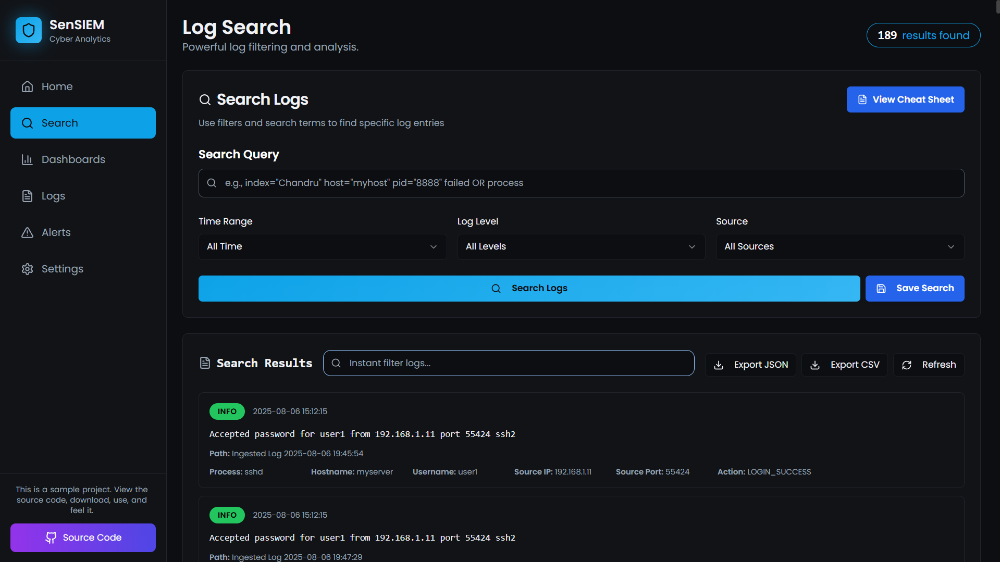

<div align="center">
  

  # ⚡ SenSIEM – Sample Log Viewer Page  

  🚀 A modern, interactive **SIEM (Security Information and Event Management)** inspired dashboard built with **React + Tailwind + shadcn/ui**.  
  Browse, search, and analyze logs in real-time with mock data support and a clean UI.  
</div>

---

## 🌐 Live Demo
👉 [Click here to view the page](https://chandruthehacker.github.io/SenSIEM-sample-page)  

---

## 📸 Preview
Here’s how it looks in action:



---

## ✨ Features
- 🔍 **Search & Filter Logs** – Quickly find log entries by message or type.  
- 📊 **Log Metadata Viewer** – Inspect detailed metadata like process, PID, IPs, and more.  
- ⚡ **Mock Data Fallback** – Works even without backend (shows sample logs).  
- 🔄 **Auto Refresh & Loader** – Refresh logs with smooth loader animation.  
- 📱 **Responsive UI** – Optimized for desktop and mobile.

---

## 🛠️ Tech Stack
- **React** ⚛️  
- **TailwindCSS** 🎨  
- **shadcn/ui + lucide-react icons** 🧩  
- **Axios** 🌐  

---

## 📂 Project Setup
Clone and run locally:

```bash
# Clone the repo
git clone https://github.com/your-username/SenSIEM-sample-page.git

# Move into project folder
cd SenSIEM-sample-page

# Install dependencies
npm install

# Start dev server
npm run dev
```

